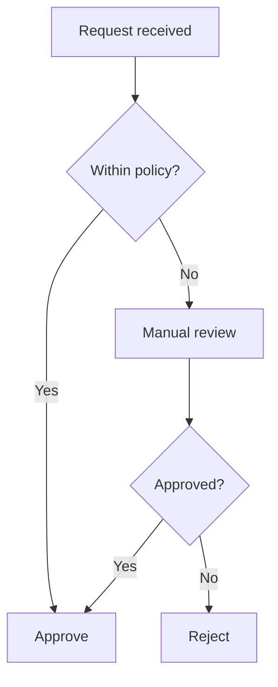
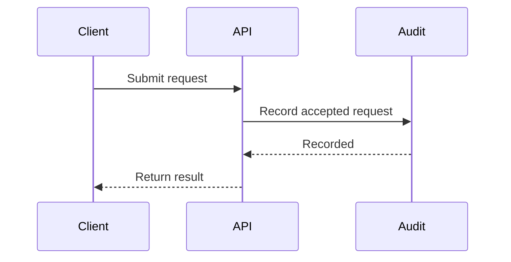
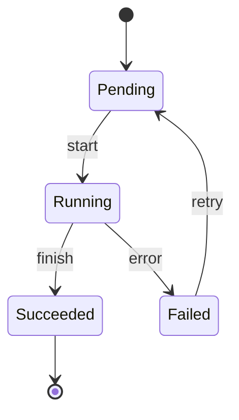
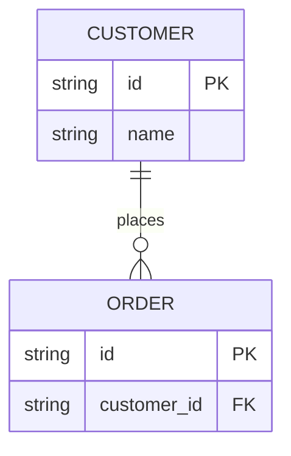

# Mermaid

A text-first route for ordinary diagrams maintained beside code. This is the `portable-docs` route,
not an assertion that the report renderer implements every Mermaid feature. Read
[workflows](../workflows.md) before choosing a source owner.

## Fit and boundaries

Use flowcharts, sequence diagrams, state diagrams, small class diagrams and ER diagrams when maintaining
relationships matters more than controlling coordinates. GitHub supports `mermaid` Markdown fences,
but its renderer version is controlled by GitHub; other Markdown hosts need their own integration.

Keep Graphviz for dense computed graphs; PlantUML for its verified specialized semantics/stencils;
ECharts/Vega for statistical graphics; Excalidraw for human-controlled positions. A Mermaid flowchart
is not a BPMN validator. Do not infer universal support from the newest Mermaid documentation.

## Authoring rules

- Use canonical `mermaid` fences and conservative syntax; keep stable ASCII IDs and descriptive labels.
- Keep one definition per fence. Split dense graphs into views instead of adding layout workarounds.
- Use `subgraph` for logical grouping, not a promise of exact coordinates. Do not require custom icons,
  external fonts, HTML labels, clicks, beta diagram types or optional layouts on an unverified host.
- For controlled rendering, lock the renderer version and keep a secure configuration (`strict` or a
  suitable sandbox); do not weaken security simply to make a label or link work.
- Keep a caption and prose explanation. Where supported, use Mermaid accessibility metadata as well.

## Four portable recipes

These are authoring fixtures, **not browser-rendered evidence for every host**. Validate on the target.

### Approval: which requests need review?

### API exchange: when is the audit event written?

### Lifecycle: how can a failed job recover?

### Data model: who owns an order?

## Styling and export

Native portable mode may rely on the host default when configuration cannot be controlled. That is an
explicit portability exception, not a claim of identical colours across platforms. When a fixed look
is required, use a pinned renderer with the [palette contract](../styles/palette.md) and
[diagram adapters](../styles/diagram-adapters.md), then publish an SVG/PNG alongside the source.

Use the official Mermaid CLI in a project that has installed and locked it, for example its `mmdc`
binary with `-i architecture.mmd -o architecture.svg`. This repository does not install the CLI.
Test the actual Markdown host and the image route separately. The report CLI's `.mmd` input listing
must not be treated as evidence for all syntax, layouts or themes.

## Verification and fallback

Check branch labels, relationship directions, long/non-Latin labels, wrapping, clipping and export
width. A parser success does not prove a usable picture. If a host cannot render the needed syntax,
pre-render a preview rather than silently changing the diagram's semantics. If human layout is needed,
follow [Excalidraw](excalidraw.md) and choose a single source owner after conversion.

## Sources and coverage

[Coverage ledger](coverage/mermaid.md) distinguishes guidance from runtime verification.
Primary references: [Mermaid syntax](https://mermaid.js.org/intro/syntax-reference.html),
[GitHub diagram support](https://docs.github.com/en/get-started/writing-on-github/working-with-advanced-formatting/creating-diagrams),
[Mermaid CLI](https://github.com/mermaid-js/mermaid-cli),
[theming](https://mermaid.js.org/config/theming.html) and
[security configuration](https://mermaid.js.org/config/schema-docs/config.html#securitylevel).
